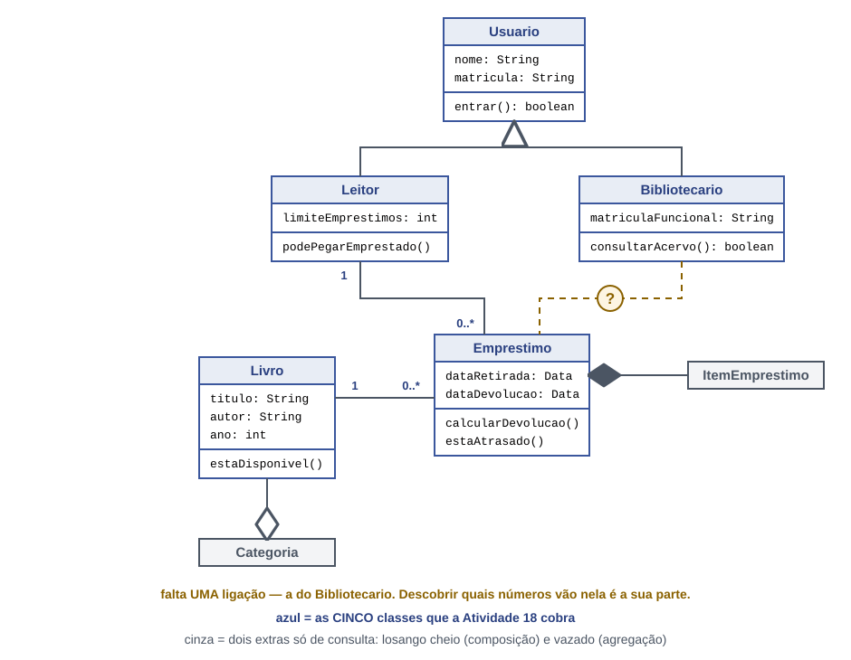

# BiblioTech
​
Sistema de emprestimo de livros para a biblioteca do campus.
​
## 1. O projeto
​
O BiblioTech é um sistema que tem como finalidade facilitar o trabalho do biliotecário, e dos estudantes quando forem emprestar, devolver, reservar ou cadastrar livros.

## 2. Historias de usuario
​
| # | Historia de usuario |
|---|---|
| HU01 | Como leitor, quero consultar a disponibilidade de um livro, para saber se posso pega-lo emprestado sem ir ate o balcao. |
| HU02 | Como leitor, quero devolver um livro, para nao ficar com pendencia na biblioteca. |
| HU03 | Como bibliotecaria, quero registrar um emprestimo, para saber quem esta com cada exemplar. |
| HU04 | Como bibliotecaria, quero cadastrar um livro novo, para que ele possa ser encontrado no sistema. |
| HU05 | Como bibliotecaria, quero ver os emprestimos atrasados, para cobrar a

## 3. Requisitos
​
### Requisitos funcionais
​
| # | Requisito funcional | Veio da |
|---|---|---|
| RF01 | O sistema deve permitir que a bibliotecaria cadastre um livro no acervo. | HU04 |
| RF02 | O sistema deve permitir que a bibliotecaria cadastre um leitor. | regra de acesso: so quem tem cadastro leva livro |
| RF03 | O sistema deve permitir que o leitor consulte a disponibilidade de um livro. | HU01 |
| RF04 | O sistema deve permitir que a bibliotecaria registre a devolucao de um livro. | HU02 |
| RF05 | O sistema deve permitir que a bibliotecaria registre o emprestimo de um livro. | HU03 |
| RF06 | O sistema deve calcular a multa por atraso da devolução | HU06 |
​
### Requisitos nao funcionais
​
| # | Requisito nao funcional |
|---|---|
| RNF01 | A consulta de disponibilidade deve responder em menos de 3 segundos. |
| RNF02 | Somente usuarios identificados como bibliotecarios podem alterar o acervo. |

## 4. Diagramas (feitos em APS)
​
### Casos de uso
​

​
### Classes
​

## 5. O que o codigo devolveu ao diagrama (aula 37)

- Livro ganhou o atributo disponivel: boolean, porque estaDisponivel() precisa guardar o estado.
- Leitor ganhou livrosEmMaos: int, porque podePegarEmprestado() compara com o limite.

## 6. Classe que o código pediu ao diagrama (aula 39)

- O código do BilioTech pediu uma sexta classe ao diagrama: Biblioteca.java.
- Ela contém as listas dos livros, leitores e emprestimos em um só lugar, facilitando o manuseio dessas informações.